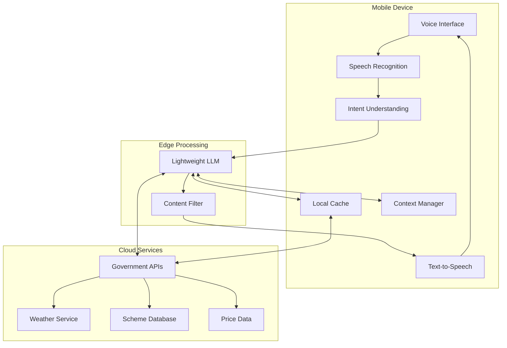

# Design Document: Rural Voice Assistant

## Overview

The Rural Voice Assistant is a mobile-first, voice-centric AI system designed to bridge the digital divide for farmers and rural citizens in India. The system leverages on-device AI processing for core functions, multi-language speech recognition, and context-aware information retrieval to provide critical agricultural and government scheme information through natural voice interactions.

The architecture prioritizes offline functionality, low-bandwidth optimization, and privacy-first design to address the unique constraints of rural connectivity and device capabilities. The system integrates with government data sources like AGMARKNET for crop prices and official scheme databases while maintaining local caching for reliability.

## Architecture

### High-Level Architecture



### System Components

**On-Device Layer:**
- Voice Interface: Handles audio input/output with noise cancellation
- Speech Recognition: Converts speech to text in local languages
- Intent Understanding: Classifies user requests and extracts entities
- Text-to-Speech: Generates natural speech responses
- Local Cache: Stores critical information for offline access
- Context Manager: Maintains user preferences and conversation state

**Edge Processing Layer:**
- Lightweight LLM: Processes natural language and generates responses
- Content Filter: Ensures accuracy and appropriateness of information

**Cloud Services Layer:**
- Government APIs: AGMARKNET, scheme databases, weather services
- Data Synchronization: Updates local cache when connectivity allows

## Components and Interfaces

### Voice Interface Component

**Responsibilities:**
- Audio capture with noise suppression
- Voice activity detection
- Audio preprocessing for speech recognition
- Audio playback for TTS responses

**Key Interfaces:**
```typescript
interface VoiceInterface {
  startListening(): Promise<AudioStream>
  stopListening(): void
  playResponse(audio: AudioBuffer): Promise<void>
  setLanguage(language: SupportedLanguage): void
}

interface AudioStream {
  data: Float32Array
  sampleRate: number
  channels: number
}
```

### Speech Recognition Component

**Responsibilities:**
- Convert speech to text for Hindi, Tamil, Telugu, Bengali, Marathi
- Handle regional dialects and accents
- Provide confidence scores for recognition quality
- Support offline recognition for basic commands

**Key Interfaces:**
```typescript
interface SpeechRecognizer {
  recognize(audio: AudioStream, language: SupportedLanguage): Promise<RecognitionResult>
  setOfflineMode(enabled: boolean): void
  calibrateForUser(samples: AudioStream[]): Promise<void>
}

interface RecognitionResult {
  text: string
  confidence: number
  language: SupportedLanguage
  alternatives?: string[]
}
```

**Implementation Approach:**
- Primary: Leverage AI4Bharat/Indic-TTS models for Indian languages
- Fallback: Google Speech-to-Text API with language detection
- Offline: TinyML models for basic wake words and commands
- Optimization: Audio compression and chunked processing for low bandwidth

### Intent Understanding Component

**Responsibilities:**
- Classify user intents (crop prices, weather, schemes, general info)
- Extract entities (crop names, locations, dates)
- Handle context from previous conversations
- Manage ambiguous queries with clarification

**Key Interfaces:**
```typescript
interface IntentClassifier {
  classifyIntent(text: string, context: ConversationContext): Promise<Intent>
  extractEntities(text: string, intent: IntentType): Promise<Entity[]>
  needsClarification(intent: Intent): boolean
}

interface Intent {
  type: IntentType
  confidence: number
  entities: Entity[]
  requiresLocation: boolean
  requiresPersonalInfo: boolean
}

enum IntentType {
  CROP_PRICES = "crop_prices",
  WEATHER = "weather", 
  GOVERNMENT_SCHEMES = "government_schemes",
  FARMING_ADVICE = "farming_advice",
  GENERAL_INFO = "general_info"
}
```

**Implementation Approach:**
- Primary: Fine-tuned lightweight transformer model for agricultural domain
- Fallback: Rule-based classification with keyword matching
- Entity Extraction: Named Entity Recognition for crops, locations, schemes
- Context: Maintain conversation history for 5 previous exchanges

### Information Retrieval Component

**Responsibilities:**
- Fetch data from government APIs (AGMARKNET, weather, schemes)
- Implement caching strategy for offline access
- Handle API rate limits and failures gracefully
- Provide location-based filtering of information

**Key Interfaces:**
```typescript
interface InformationRetriever {
  getCropPrices(crop: string, location: string): Promise<PriceData[]>
  getWeatherInfo(location: string): Promise<WeatherData>
  getSchemeInfo(category: string, userProfile: UserProfile): Promise<SchemeData[]>
  getFarmingAdvice(crop: string, season: string, location: string): Promise<AdviceData>
}

interface PriceData {
  crop: string
  market: string
  minPrice: number
  maxPrice: number
  modalPrice: number
  date: Date
  unit: string
}
```

**Data Sources:**
- AGMARKNET API: Daily crop prices from mandis across India
- India Meteorological Department: Weather forecasts and advisories
- Government Scheme Database: PM-KISAN, PMFBY, PMKSY, and other schemes
- Agricultural Universities: Farming best practices and seasonal advice

### Text-to-Speech Component

**Responsibilities:**
- Generate natural speech in user's preferred language
- Handle numbers, currency, and technical terms appropriately
- Support different speaking rates for different user groups
- Provide offline TTS for critical information

**Key Interfaces:**
```typescript
interface TextToSpeech {
  synthesize(text: string, language: SupportedLanguage): Promise<AudioBuffer>
  setVoiceProfile(profile: VoiceProfile): void
  setSpeakingRate(rate: number): void
  preloadCriticalPhrases(phrases: string[]): Promise<void>
}

interface VoiceProfile {
  gender: 'male' | 'female'
  age: 'young' | 'middle' | 'elderly'
  accent: 'standard' | 'regional'
}
```

**Implementation Approach:**
- Primary: AI4Bharat Indic-TTS for natural Indian language voices
- Fallback: Google Text-to-Speech with Indian English
- Offline: Pre-recorded audio for common responses
- Optimization: Audio compression and streaming for low bandwidth

### Local Cache Component

**Responsibilities:**
- Store frequently accessed information locally
- Implement intelligent cache eviction policies
- Sync with cloud when connectivity is available
- Encrypt sensitive user data

**Key Interfaces:**
```typescript
interface LocalCache {
  store(key: string, data: any, ttl: number): Promise<void>
  retrieve(key: string): Promise<any | null>
  sync(): Promise<SyncResult>
  clear(): Promise<void>
  getStorageUsage(): Promise<StorageInfo>
}

interface SyncResult {
  updated: string[]
  failed: string[]
  totalSynced: number
}
```

**Caching Strategy:**
- Government Schemes: Cache for 7 days, high priority
- Crop Prices: Cache for 1 day, medium priority  
- Weather Data: Cache for 6 hours, high priority
- User Preferences: Cache indefinitely, highest priority
- Farming Advice: Cache for 30 days, low priority

### Context Manager Component

**Responsibilities:**
- Maintain user profile and preferences
- Track conversation history and context
- Manage location data with privacy controls
- Handle user authentication and data protection

**Key Interfaces:**
```typescript
interface ContextManager {
  getUserProfile(): Promise<UserProfile>
  updateUserProfile(profile: Partial<UserProfile>): Promise<void>
  getConversationContext(): ConversationContext
  updateContext(context: Partial<ConversationContext>): void
  clearPersonalData(): Promise<void>
}

interface UserProfile {
  preferredLanguage: SupportedLanguage
  location: LocationData
  farmingProfile: FarmingProfile
  accessibilityNeeds: AccessibilitySettings
}

interface ConversationContext {
  previousIntents: Intent[]
  currentTopic: string
  lastInteraction: Date
  sessionId: string
}
```

## Data Models

### Core Data Structures

**User Profile Model:**
```typescript
interface UserProfile {
  id: string
  preferredLanguage: SupportedLanguage
  location: {
    state: string
    district: string
    block?: string
    coordinates?: { lat: number, lng: number }
  }
  farmingProfile: {
    landSize: number
    cropTypes: string[]
    farmingExperience: 'beginner' | 'intermediate' | 'experienced'
    irrigationType: 'rainfed' | 'irrigated' | 'mixed'
  }
  accessibilityNeeds: {
    speakingRate: 'slow' | 'normal' | 'fast'
    voiceProfile: VoiceProfile
    repeatEnabled: boolean
  }
  privacySettings: {
    shareLocation: boolean
    storeFarmingData: boolean
    enablePersonalization: boolean
  }
}
```

**Information Models:**
```typescript
interface CropPriceInfo {
  crop: string
  variety?: string
  market: string
  state: string
  district: string
  prices: {
    minimum: number
    maximum: number
    modal: number
  }
  unit: string
  date: Date
  trend: 'rising' | 'falling' | 'stable'
}

interface GovernmentScheme {
  id: string
  name: string
  nameLocal: Record<SupportedLanguage, string>
  description: string
  descriptionLocal: Record<SupportedLanguage, string>
  eligibility: {
    landSize?: { min: number, max: number }
    income?: { max: number }
    category?: string[]
    location?: string[]
  }
  benefits: string
  applicationProcess: string[]
  documents: string[]
  deadline?: Date
  contactInfo: {
    phone?: string
    website?: string
    office?: string
  }
}

interface WeatherInfo {
  location: string
  current: {
    temperature: number
    humidity: number
    rainfall: number
    windSpeed: number
    conditions: string
  }
  forecast: {
    date: Date
    minTemp: number
    maxTemp: number
    rainfall: number
    conditions: string
    advisory?: string
  }[]
  agriculturalAdvisory: {
    crops: string[]
    recommendations: string[]
    warnings?: string[]
  }
}
```

### Database Schema

**Local SQLite Schema:**
```sql
-- User data
CREATE TABLE user_profiles (
  id TEXT PRIMARY KEY,
  preferred_language TEXT NOT NULL,
  location_data TEXT, -- JSON
  farming_profile TEXT, -- JSON
  accessibility_settings TEXT, -- JSON
  privacy_settings TEXT, -- JSON
  created_at TIMESTAMP DEFAULT CURRENT_TIMESTAMP,
  updated_at TIMESTAMP DEFAULT CURRENT_TIMESTAMP
);

-- Cached information
CREATE TABLE cached_data (
  key TEXT PRIMARY KEY,
  data TEXT NOT NULL, -- JSON
  ttl INTEGER NOT NULL,
  created_at TIMESTAMP DEFAULT CURRENT_TIMESTAMP
);

-- Conversation history
CREATE TABLE conversations (
  id TEXT PRIMARY KEY,
  user_id TEXT,
  intent_type TEXT,
  query TEXT,
  response TEXT,
  language TEXT,
  timestamp TIMESTAMP DEFAULT CURRENT_TIMESTAMP,
  FOREIGN KEY (user_id) REFERENCES user_profiles(id)
);

-- Offline content
CREATE TABLE offline_content (
  id TEXT PRIMARY KEY,
  content_type TEXT NOT NULL,
  language TEXT NOT NULL,
  data TEXT NOT NULL, -- JSON
  priority INTEGER DEFAULT 1,
  last_updated TIMESTAMP DEFAULT CURRENT_TIMESTAMP
);
```

## Correctness Properties

*A property is a characteristic or behavior that should hold true across all valid executions of a system—essentially, a formal statement about what the system should do. Properties serve as the bridge between human-readable specifications and machine-verifiable correctness guarantees.*

<function_calls>
<invoke name="prework">
<parameter name="featureName">rural-voice-assistant

Based on the prework analysis, I'll now perform property reflection to eliminate redundancy:

**Property Reflection:**
- Properties 1.1 and 7.1 both test Hindi language support - can be combined into comprehensive language support property
- Properties 1.2 and 1.5 both test audio processing - can be combined into audio input handling property  
- Properties 2.1, 2.2, 2.3 all test intent classification - can be combined into comprehensive intent classification property
- Properties 3.1, 3.4, 3.5 all test location-based data retrieval - can be combined into location-aware information retrieval property
- Properties 4.1, 4.3, 4.5 all test speech synthesis quality - can be combined into comprehensive TTS property
- Properties 5.1, 5.4 both test offline data access - can be combined into offline functionality property
- Properties 6.1, 6.3, 6.4 all test data privacy - can be combined into comprehensive privacy property
- Properties 9.2, 9.3, 9.4 all test user interaction patterns - can be combined into user experience property

### Correctness Properties

Property 1: Multi-language speech recognition accuracy
*For any* audio input in Hindi, Tamil, Telugu, Bengali, or Marathi, the Speech_Recognizer should produce accurate text output with confidence scores above the minimum threshold
**Validates: Requirements 1.1, 7.1, 7.3**

Property 2: Audio input processing robustness  
*For any* audio stream with background noise or multiple speakers, the Speech_Recognizer should filter noise and focus on the primary speaker while maintaining recognition accuracy
**Validates: Requirements 1.2, 1.5**

Property 3: Intent classification accuracy
*For any* user query about crop prices, government schemes, weather, or farming advice, the Intent_Classifier should correctly identify the intent type and extract relevant entities
**Validates: Requirements 2.1, 2.2, 2.3**

Property 4: Context-aware intent improvement
*For any* conversation with available history, the Intent_Classifier should achieve higher accuracy when using conversation context compared to processing queries in isolation
**Validates: Requirements 2.5**

Property 5: Ambiguous query handling
*For any* ambiguous or unclear user input, the Voice_Assistant should request clarification with specific options rather than making incorrect assumptions
**Validates: Requirements 1.3, 2.4**

Property 6: Location-aware information retrieval
*For any* information request with available location data, the Information_Retriever should return location-specific results (crop prices from nearest mandis, local weather, regional schemes)
**Validates: Requirements 3.1, 3.4, 3.5**

Property 7: User profile-based personalization
*For any* user with a defined profile, the Information_Retriever should prioritize information relevant to their farming status, location, and demographics
**Validates: Requirements 3.2, 3.3**

Property 8: Natural speech synthesis quality
*For any* text response in supported languages, the Speech_Synthesizer should produce natural-sounding speech with correct pronunciation of numbers, technical terms, and local context
**Validates: Requirements 4.1, 4.3, 4.5**

Property 9: Response formatting for comprehension
*For any* complex information or step-by-step instructions, the Voice_Assistant should break content into digestible segments with appropriate pauses and allow repetition requests
**Validates: Requirements 4.2, 4.4**

Property 10: Offline functionality preservation
*For any* scenario with no internet connectivity, the Offline_Cache should provide access to previously downloaded critical information including government schemes and emergency contacts
**Validates: Requirements 5.1, 5.4**

Property 11: Bandwidth optimization
*For any* network condition with limited bandwidth, the Voice_Assistant should compress audio data while maintaining speech quality and queue requests during intermittent connectivity
**Validates: Requirements 5.2, 5.3**

Property 12: Data synchronization consistency
*For any* period when connectivity is restored, the Voice_Assistant should update cached information with the latest government schemes and price data without data corruption
**Validates: Requirements 5.5**

Property 13: Privacy-preserving data handling
*For any* personal information collected, the Voice_Assistant should store it locally with encryption, delete voice recordings after processing, and retain only general location data
**Validates: Requirements 6.1, 6.2, 6.3**

Property 14: Secure data transmission
*For any* data transmission to external services, the Voice_Assistant should use secure protocols and transmit only the minimal necessary information
**Validates: Requirements 6.4**

Property 15: Data deletion compliance
*For any* user request to delete personal data, the Voice_Assistant should remove all stored personal information within 24 hours
**Validates: Requirements 6.5**

Property 16: Language switching adaptability
*For any* mid-conversation language change, the Voice_Assistant should seamlessly adapt to the new language and continue the conversation context
**Validates: Requirements 7.2**

Property 17: Cultural and linguistic appropriateness
*For any* response involving cultural context or technical terms, the Voice_Assistant should provide culturally appropriate responses and use commonly understood local equivalents
**Validates: Requirements 7.4, 7.5**

Property 18: Information accuracy and verification
*For any* government scheme information provided, the Content_Filter should verify data against official sources within 24 hours and timestamp market price data with freshness indicators
**Validates: Requirements 8.1, 8.2**

Property 19: Uncertainty and conflict handling
*For any* unverified or conflicting information, the Voice_Assistant should clearly indicate uncertainty, present multiple sources, and recommend official verification channels
**Validates: Requirements 8.3, 8.4, 8.5**

Property 20: User experience consistency
*For any* user interaction involving errors, multiple options, or repetition requests, the Voice_Assistant should provide patient guidance without technical jargon, clear option presentation, and unlimited repetitions
**Validates: Requirements 9.2, 9.3, 9.4**

Property 21: Responsive command handling
*For any* stop or exit command in any supported language, the Voice_Assistant should respond immediately to terminate the current operation
**Validates: Requirements 9.5**

Property 22: Performance on constrained devices
*For any* device with 2GB RAM or less, the Voice_Assistant should maintain responsive performance and provide speech recognition results within 3 seconds for simple queries
**Validates: Requirements 10.1, 10.2**

Property 23: Session integrity under load
*For any* scenario with multiple simultaneous users, the Voice_Assistant should maintain individual session integrity without cross-contamination of user data or context
**Validates: Requirements 10.3**

Property 24: Localized error handling
*For any* system error, the Voice_Assistant should provide helpful error messages in the user's preferred language
**Validates: Requirements 10.4**

Property 25: Seamless system updates
*For any* system update, the Voice_Assistant should update critical components without disrupting active user sessions
**Validates: Requirements 10.5**

## Error Handling

### Error Categories and Responses

**Speech Recognition Errors:**
- Low confidence recognition: Request user to repeat more clearly
- No speech detected: Prompt user with "I didn't hear anything, please try again"
- Unsupported language: Gracefully switch to supported language or English fallback
- Audio quality issues: Guide user to improve audio conditions

**Intent Classification Errors:**
- Ambiguous intent: Present clarification options in user's language
- Unknown intent: Offer help menu with available capabilities
- Missing entities: Ask specific questions to gather required information
- Context confusion: Reset conversation context and start fresh

**Information Retrieval Errors:**
- API failures: Fall back to cached data with staleness warning
- Network timeouts: Queue request for retry when connectivity improves
- Data not found: Suggest alternative queries or broader search terms
- Rate limiting: Implement exponential backoff and inform user of delay

**System Errors:**
- Memory constraints: Clear non-essential cache and continue with core functions
- Storage full: Prompt user to clear data or upgrade storage
- Component failures: Gracefully degrade to available functionality
- Update failures: Rollback to previous stable version

### Error Recovery Strategies

**Graceful Degradation:**
- Offline mode when network unavailable
- Text-only mode if TTS fails
- Basic recognition if advanced models fail
- Cached responses for common queries

**User Communication:**
- Always explain errors in user's preferred language
- Provide actionable steps for resolution
- Offer alternative approaches when possible
- Maintain patient, helpful tone throughout

## Testing Strategy

### Dual Testing Approach

The Rural Voice Assistant requires comprehensive testing through both unit tests and property-based tests to ensure reliability across diverse rural conditions and user scenarios.

**Unit Testing Focus:**
- Specific examples of speech recognition for each supported language
- Edge cases like very quiet speech, heavy accents, or technical terminology
- Integration points between components (ASR → NLU → TTS pipeline)
- Error conditions and recovery scenarios
- Offline functionality with specific cached data scenarios
- Privacy compliance with specific data handling examples

**Property-Based Testing Focus:**
- Universal properties that hold across all supported languages and dialects
- Comprehensive input coverage through randomized speech samples, user queries, and system states
- Performance properties under varying network conditions and device constraints
- Data consistency properties during sync operations
- Security properties for data encryption and transmission

**Property Test Configuration:**
- Minimum 100 iterations per property test to account for randomization
- Each property test references its corresponding design document property
- Tag format: **Feature: rural-voice-assistant, Property {number}: {property_text}**
- Custom generators for Indian language text, agricultural terms, and rural user scenarios

**Testing Infrastructure:**
- Automated testing on low-end Android devices (2GB RAM, limited storage)
- Network simulation for various connectivity conditions (2G, 3G, intermittent)
- Multi-language test data sets with regional dialects and pronunciations
- Government API mocking for consistent testing without external dependencies
- Privacy compliance verification through data flow analysis

**Performance Testing:**
- Speech recognition latency under various audio conditions
- Memory usage monitoring on constrained devices
- Battery consumption during extended voice interactions
- Cache performance and storage optimization
- Concurrent user session handling

The testing strategy ensures the system works reliably for rural users across India's diverse linguistic, technological, and connectivity landscape while maintaining privacy and performance standards.